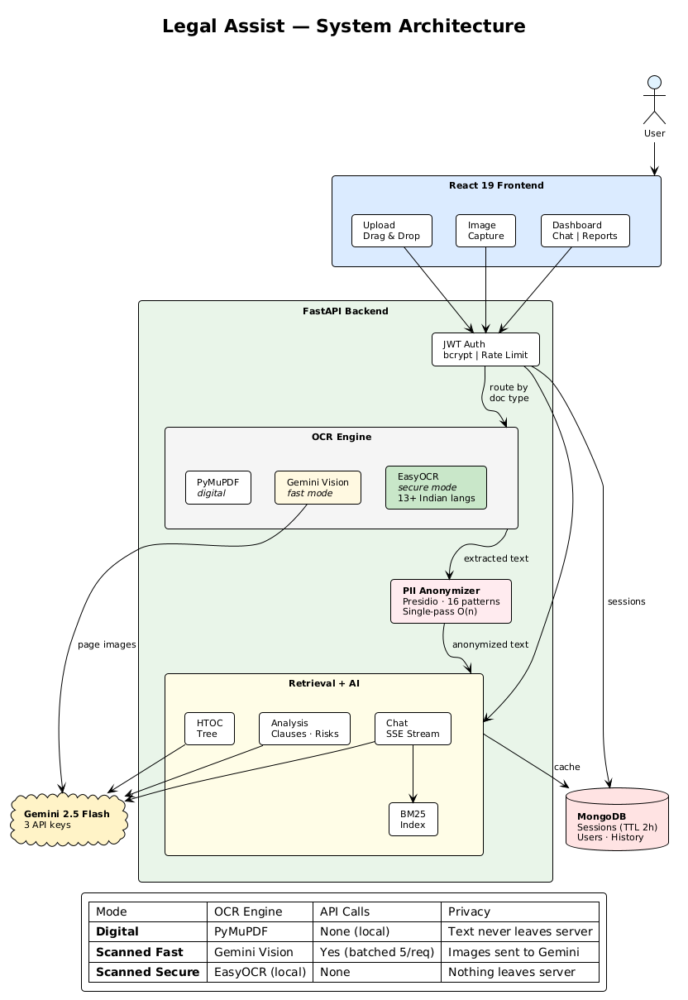
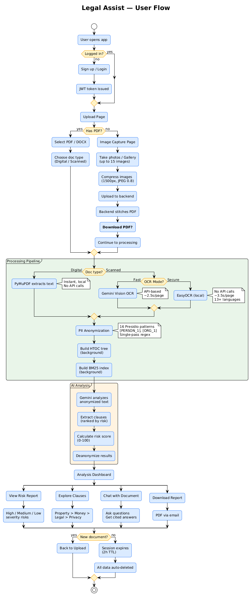

# Legal Assist AI

A privacy-preserving full-stack platform for automated legal document analysis. Upload contracts, agreements, or case files and get instant risk assessment, clause extraction, and interactive Q&A — all without storing raw documents.



---

## Features

- **Zero-Retention Processing** — Documents processed in-memory. Raw text never persisted; only PII-anonymized content stored temporarily (TTL 2 hours, auto-deleted).
- **PII Anonymization** — Presidio-powered regex engine with 16 custom Indian recognizers (Aadhaar, PAN, GSTIN, Voter ID, Passport, IFSC, etc.) — **100% detection rate on Indian document IDs**.
- **AI-Powered Clause Extraction** — Gemini 2.5 Flash extracts 40+ clauses from loan/legal documents, ranked by real-world danger: property seizure > monetary penalties > criminal liability > privacy risks. **F1 = 0.82, 87.5% recall on critical clauses.**
- **Indian Legal Domain Knowledge** — Prompt-engineered for Indian property law: Transfer of Property Act, SARFAESI, NI Act, DPDPA. Document-specific checks for Sale Deed, Lease, Mortgage, POA, Gift Deed, and Loan agreements.
- **Vectorless RAG Chat** — Ask questions about your document. Hybrid BM25 + HTOC (Hierarchical Table of Contents) retrieval achieves **90% hit rate at <5ms latency** with zero embedding cost.
- **Dual OCR Modes** — Fast (Gemini Vision API, 13+ languages) and Secure (EasyOCR, fully local, no data leaves server).
- **Image Capture** — No PDF? Take photos of your document (up to 15 pages), compressed client-side, stitched to PDF server-side.
- **PDF Reports** — Download or email styled analysis reports.
- **Cancel Processing** — Cancel stuck uploads without wasting API quota.

---

## System Architecture


### Processing Pipeline

```
                    ┌─────────────────────────────┐
                    │      React 19 Frontend       │
                    │  Upload │ Dashboard │ Chat    │
                    └────────────┬────────────────┘
                                 │ HTTPS + JWT
                                 ▼
                    ┌─────────────────────────────┐
                    │      FastAPI Backend          │
                    │  Auth │ Rate Limit │ CORS     │
                    └────────────┬────────────────┘
                                 │
              ┌──────────────────┼──────────────────┐
              ▼                  ▼                   ▼
        ┌──────────┐     ┌────────────┐      ┌──────────┐
        │ OCR Engine│     │   Privacy   │      │ Retrieval│
        │          │     │   Layer     │      │  + AI    │
        │ PyMuPDF  │     │            │      │          │
        │ (digital)│────▶│ PII Anon.  │─────▶│ HTOC Tree│
        │          │     │ 16 Presidio │      │ BM25 Idx │
        │ Gemini   │     │ patterns    │      │ Analysis │
        │ Vision   │     │ Single-pass │      │ Chat SSE │
        │ (fast)   │     │ O(n) regex  │      │          │
        │          │     │            │      │          │
        │ EasyOCR  │     └────────────┘      └─────┬────┘
        │ (secure) │                                │
        └──────────┘                    ┌───────────┼──────────┐
                                        ▼           ▼          ▼
                                    MongoDB    Gemini API   Gemini
                                   (TTL 2h)   (Analysis)   Vision
```

### Three OCR Modes

| Mode | Engine | API Calls | Privacy | Latency | Languages |
|------|--------|-----------|---------|---------|-----------|
| **Digital** | PyMuPDF | None | Text never leaves server | Instant | N/A |
| **Fast** | Gemini Vision | Yes (batched) | Images sent to Gemini | ~9s/page | 100+ |
| **Secure** | EasyOCR | None | Nothing leaves server | ~3.5s/page | 80+ (13 Indian) |

### Vectorless RAG: How Chat Works

```
User Question
      │
      ▼
┌─ BM25 Search (<5ms) ────────────────────────┐
│  Keyword match against HTOC-boosted index    │
│  90% hit rate, zero API calls                │
└──────────┬───────────────────────────────────┘
           │ Low confidence?
           ▼
┌─ LLM Tree Search (~3-5s) ───────────────────┐
│  Gemini navigates HTOC tree structure        │
│  Selects most relevant sections              │
└──────────┬───────────────────────────────────┘
           │
           ▼
┌─ Gemini Generate ────────────────────────────┐
│  Answer grounded in retrieved sections       │
│  Source citations + page references          │
│  Streamed via SSE to frontend                │
└──────────────────────────────────────────────┘
```

---

## Performance Benchmarks

### Clause Detection (7-page Loan Application)

| Metric | Score |
|--------|-------|
| Precision | 87.2% |
| Recall | 77.4% |
| F1 Score | **0.820 (Excellent)** |
| Critical Clause Recall | 87.5% |
| Clauses Extracted | 47 / 53 expected |

### Search/Retrieval Strategy Comparison

| Strategy | Hit Rate | Latency | API Calls |
|----------|----------|---------|-----------|
| **BM25+HTOC (production)** | **90%** | **2.3ms** | **0** |
| BM25 plain | 90% | 19.9ms | 0 |
| TF-IDF cosine | 80% | 709ms | 0 |
| Tree DFS | 60% | 0.1ms | 0 |
| Tree BFS | 60% | 0.1ms | 0 |

### PII Detection

| Entity Category | Presidio (spaCy) | Regex Only | Hybrid |
|----------------|-----------------|------------|--------|
| Indian Doc IDs | 57.1% | **100.0%** | **100.0%** |
| Locations | 46.2% | 53.8% | **92.3%** |
| Overall Recall | 44.8% | 51.7% | **75.9%** |
| F1 Score | 0.333 | 0.500 | 0.407 |

### OCR Accuracy (Scanned Legal Document)

| Metric | EasyOCR | Tesseract | Gemini Vision |
|--------|---------|-----------|---------------|
| CER (%) | 32.29 | **13.27** | **13.10** |
| Latency (s/page) | 23.58 | **1.19** | 9.17 |
| Cost (100 pages) | $0.00 | $0.00 | ~$1.20 |
| Local Processing | Yes | Yes | No |

### Storage: Vector RAG vs HTOC

| Metric | Vector RAG | HTOC (Ours) |
|--------|-----------|-------------|
| Storage per document | ~47 KB | **~5 KB** |
| Retrieval latency | ~105ms | **<5ms** |
| Embedding model needed | Yes | **No** |
| Vector DB needed | Yes ($25-70/mo) | **No** |
| GPU/RAM overhead | ~500MB | **~0MB** |
| Works offline | No | **Yes (BM25)** |

### End-to-End Latency (7-page Digital PDF)

| Operation | Latency |
|-----------|---------|
| Upload + PII Anonymization | 6.7s |
| HTOC + BM25 Build | 5.1s |
| Analysis (fresh) | 94.7s |
| Analysis (cached) | 4.1s |
| Chat (avg of 5 questions) | 14.7s |

---

## Tech Stack

### Frontend
| Technology | Purpose |
|---|---|
| React 19 + TypeScript | UI framework |
| Tailwind CSS 4 | Styling (Material Design 3 theme) |
| Radix UI | Accessible component primitives |
| React Router v7 | Client-side routing |
| Axios | API client with JWT auth |
| Framer Motion | Animations |
| React PDF | In-browser document viewer |
| Vite 6 | Build tool |

### Backend
| Technology | Purpose |
|---|---|
| FastAPI | Async API framework |
| Google Gemini 2.5 Flash | Document analysis, chat, OCR |
| Presidio | PII detection (16 custom Indian patterns) |
| PyMuPDF | PDF text extraction & rendering |
| EasyOCR | Local OCR (13+ Indian languages) |
| MongoDB (Motor) | Async session store with TTL |
| BM25 (rank-bm25) | Keyword search with HTOC boost |
| WeasyPrint | PDF report generation |
| SSE-Starlette | Server-sent events for chat streaming |

---

## Getting Started

### Prerequisites

- Python 3.11+
- Node.js 18+
- MongoDB (local or [Atlas free tier](https://www.mongodb.com/cloud/atlas))
- [Google Gemini API key](https://aistudio.google.com/apikey)

### 1. Clone

```bash
git clone https://github.com/adityaa2404/legal-assist.git
cd legal-assist
```

### 2. Backend Setup

```bash
cd backend
python -m venv venv
source venv/bin/activate  # Windows: venv\Scripts\activate
pip install -r requirements.txt
```

Create `backend/.env`:

```env
MONGODB_URI=mongodb+srv://<user>:<pass>@cluster.mongodb.net/
MONGO_DB_NAME=legal-assist
GEMINI_API_KEY=your-gemini-api-key
GEMINI_HTOC_API_KEY=your-second-key        # optional, for rate limit isolation
GEMINI_CHAT_API_KEY=your-third-key         # optional, for rate limit isolation
JWT_SECRET=your-secret-key
SESSION_TTL_SECONDS=7200
GEMINI_TIMEOUT=180
CORS_ORIGINS=["http://localhost:5173"]
```

Start the backend:

```bash
uvicorn app.main:app --reload --port 8000
```

### 3. Frontend Setup

```bash
cd frontend
npm install
```

Create `frontend/.env`:

```env
VITE_API_BASE_URL=http://localhost:8000/api/v1
```

Start the frontend:

```bash
npm run dev
```

Open [http://localhost:5173](http://localhost:5173).

### 4. Docker (Alternative)

```bash
docker-compose up --build
```

This starts frontend (port 80), backend (port 8000), and MongoDB (port 27017).

---

## Environment Variables

| Variable | Required | Default | Description |
|---|---|---|---|
| `MONGODB_URI` | Yes | — | MongoDB connection string |
| `MONGO_DB_NAME` | No | `legal-assist` | Database name |
| `GEMINI_API_KEY` | Yes | — | Primary Gemini API key (analysis) |
| `GEMINI_HTOC_API_KEY` | No | Falls back to primary | Separate key for HTOC building |
| `GEMINI_CHAT_API_KEY` | No | Falls back to primary | Separate key for chat |
| `GEMINI_TIMEOUT` | No | `90` | Max wait per Gemini call (seconds) |
| `JWT_SECRET` | No | Auto-generated | JWT signing secret (set for production!) |
| `SESSION_TTL_SECONDS` | No | `7200` | Session expiry (seconds) |
| `MAX_FILE_SIZE_MB` | No | `50` | Max upload size |
| `CORS_ORIGINS` | No | `["http://localhost:5173"]` | Allowed frontend origins |
| `SMTP_HOST` | No | — | Email server for report delivery |
| `RATE_LIMIT_RPM` | No | `300` | API rate limit per minute |

---

## API Endpoints

| Method | Endpoint | Description |
|---|---|---|
| `POST` | `/api/v1/auth/register` | Create account |
| `POST` | `/api/v1/auth/login` | Login, returns JWT |
| `POST` | `/api/v1/upload` | Upload PDF/DOCX for processing |
| `POST` | `/api/v1/upload/images` | Upload images, stitch to PDF, process |
| `GET` | `/api/v1/htoc-status` | Poll document processing status |
| `GET` | `/api/v1/htoc-tree` | Get document structure tree |
| `POST` | `/api/v1/analyze` | Run AI analysis on document |
| `GET` | `/api/v1/analyze/report` | Download PDF report |
| `POST` | `/api/v1/analyze/email` | Email PDF report |
| `POST` | `/api/v1/chat` | Chat Q&A (non-streaming) |
| `POST` | `/api/v1/chat/stream` | Chat Q&A (SSE streaming) |
| `GET` | `/api/v1/document/pdf` | Download stitched PDF (image captures) |
| `GET` | `/api/v1/history` | User's analysis history |
| `POST` | `/api/v1/history/restore` | Restore past analysis for chat |
| `GET/POST/DELETE` | `/api/v1/clause-library` | Manage saved clauses |
| `POST` | `/api/v1/compare` | Compare two document analyses |
| `GET` | `/api/v1/health` | Health check |

---

## Project Structure

```
legal-assist/
├── frontend/
│   ├── src/
│   │   ├── api/                   # Axios API clients
│   │   ├── components/
│   │   │   ├── ui/                # Radix UI primitives
│   │   │   ├── UploadView.tsx     # Document upload + live pipeline + cancel
│   │   │   ├── ImageCapturePage.tsx # Photo capture → PDF stitching
│   │   │   ├── AnalysisDashboard.tsx # Risk score, parties, summary
│   │   │   ├── ClauseExplorer.tsx # Risk-ranked clause viewer
│   │   │   ├── ChatInterface.tsx  # Streaming chat with citations
│   │   │   ├── DocumentViewer.tsx # In-browser PDF viewer
│   │   │   └── RiskPage.tsx       # Risk report
│   │   ├── contexts/              # Auth, Session, Theme, Toast
│   │   ├── hooks/                 # useSession, useChat
│   │   └── types/                 # TypeScript interfaces
│   └── vite.config.ts
├── backend/
│   ├── app/
│   │   ├── api/v1/                # Route handlers
│   │   │   ├── documents.py       # Upload + OCR + PII + image capture
│   │   │   ├── analysis.py        # Gemini analysis + caching
│   │   │   ├── chat.py            # Hybrid RAG chat + streaming
│   │   │   └── auth.py            # JWT auth + rate limiting
│   │   ├── core/                  # Config, dependencies, DB
│   │   ├── services/
│   │   │   ├── gemini_client.py   # Gemini API (3 clients, retry on 429/503)
│   │   │   ├── pii_anonymizer.py  # 16 Presidio regex patterns, single-pass O(n)
│   │   │   ├── htoc_builder.py    # Hierarchical TOC via Gemini
│   │   │   ├── bm25_search.py     # BM25 + HTOC-boosted retrieval
│   │   │   ├── tree_search.py     # LLM-guided HTOC tree navigation
│   │   │   ├── document_parser.py # PyMuPDF + Gemini Vision + EasyOCR
│   │   │   └── session_service.py # MongoDB sessions + ownership
│   │   └── models/                # Pydantic schemas
│   ├── evaluation/                # Benchmark suite
│   │   ├── run_eval.py            # Full pipeline evaluation
│   │   ├── ocr_benchmark.py       # EasyOCR vs Tesseract vs Gemini Vision
│   │   ├── pii_benchmark.py       # Presidio vs Regex vs Hybrid
│   │   ├── clause_benchmark.py    # Clause detection P/R/F1
│   │   ├── search_benchmark.py    # BM25 vs TF-IDF vs Tree DFS/BFS
│   │   └── storage_benchmark.py   # Vector RAG vs HTOC storage
│   └── requirements.txt
├── docs/
│   ├── architecture.puml          # Combined architecture (PlantUML)
│   ├── architecture.png           # Rendered diagram
│   ├── user-flow.puml             # User journey diagram
│   ├── user-flow.png              # Rendered user flow
│   └── project_report.md          # Full research report
├── docker-compose.yml
└── README.md
```

---

## Evaluation Suite

The project includes 6 benchmark scripts — no external datasets needed:

```bash
cd backend

# Full pipeline (upload → analysis → chat) on test PDFs
python -m evaluation.run_eval --email you@example.com --password pass

# OCR accuracy (EasyOCR vs Tesseract vs Gemini Vision)
python -m evaluation.ocr_benchmark --pdf evaluation/docs/digital.pdf

# PII detection (Presidio spaCy vs Regex vs Hybrid)
python -m evaluation.pii_benchmark --text evaluation/docs/scanned_ground_truth.txt

# Clause detection (F1, precision, recall)
python -m evaluation.clause_benchmark --analysis-json evaluation/docs/analysis_result.json

# Search retrieval (BM25 vs TF-IDF vs Tree DFS/BFS) — no API needed
python -m evaluation.search_benchmark --pdf evaluation/docs/sliceSFBLoanApplicationForm.pdf

# Storage comparison (Vector RAG vs HTOC)
python -m evaluation.storage_benchmark --pdf evaluation/docs/sliceSFBLoanApplicationForm.pdf
```

---

## Privacy & Security

- **Anonymize-first** — PII detected and replaced with tokens (`[PERSON_1]`, `[IN_AADHAAR_1]`) before any text reaches Gemini
- **Zero raw storage** — Original document text never persisted to disk or database
- **Session ownership** — Each session tied to user email; cross-user access blocked
- **Auto-expiry** — MongoDB TTL index auto-deletes all session data after 2 hours
- **Error sanitization** — Internal errors logged but never exposed to clients
- **Auth rate limiting** — 15/min on login, 10/min on register (brute-force protection)
- **Streaming safety** — SSE deanonymization buffered to prevent partial PII token leakage
- **Stuck session recovery** — Sessions in "processing" for >30 minutes auto-marked as failed on startup

---

## User Flow



---

## License

This project is for educational and research purposes.
