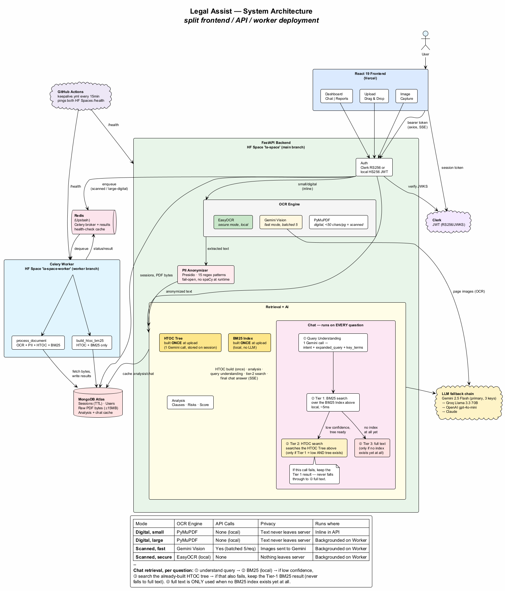
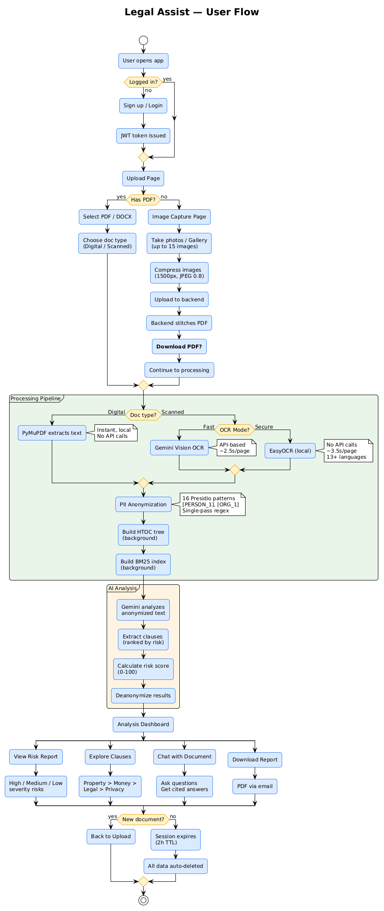

# Legal Assist AI

A privacy-preserving legal document analysis platform with a split frontend/backend deployment model. Upload contracts, agreements, or case files and get risk assessment, clause extraction, and interactive Q&A while keeping document handling local to the backend services.





---

## Features

- **Session-Scoped Storage** — Documents and extracted text are anonymized before any AI call and stored only for the session lifetime (TTL 2 hours, auto-deleted from MongoDB).
- **PII Anonymization** — Presidio-powered regex engine with 16 custom Indian recognizers (Aadhaar, PAN, GSTIN, Voter ID, Passport, IFSC, etc.) — **100% detection rate on Indian document IDs**.
- **AI-Powered Clause Extraction** — Gemini 2.5 Flash extracts 40+ clauses from loan/legal documents, ranked by real-world danger: property seizure > monetary penalties > criminal liability > privacy risks. **F1 = 0.82, 87.5% recall on critical clauses.**
- **Indian Legal Domain Knowledge** — Prompt-engineered for Indian property law: Transfer of Property Act, SARFAESI, NI Act, DPDPA. Document-specific checks for Sale Deed, Lease, Mortgage, POA, Gift Deed, and Loan agreements.
- **Vectorless RAG Chat** — Ask questions about your document. Hybrid BM25 + HTOC (Hierarchical Table of Contents) retrieval achieves **90% hit rate at <5ms latency** with zero embedding cost.
- **Multi-Provider HTOC Building** — Gemini by default; docs over 50 pages auto-route to Groq (faster, cheaper for large prompts); Gemini failures retry once before falling back to Groq automatically.
- **Dual OCR Modes** — Fast (Gemini Vision API, 13+ languages) and Secure (EasyOCR, fully local, no data leaves server).
- **Image Capture** — No PDF? Take photos of your document (up to 15 pages), compressed client-side, stitched to PDF server-side.
- **PDF Reports** — Download or email styled analysis reports.
- **Cancel Processing** — Cancel stuck uploads without wasting API quota.

---

## Current State

The project runs as a split deployment instead of a single monolith:

- **Frontend** — React + TypeScript + Vite UI, built separately and served as a static app.
- **Backend API** — FastAPI service that handles auth, uploads, analysis, chat, and document state.
- **Worker** — Celery worker for background document processing (OCR, PII, HTOC, BM25), deployed as its own container.
- **Redis** — Shared queue/broker (Upstash in production) between the API and worker.
- **MongoDB** — Session, user, analysis, and (temporary) raw-file storage.

For local development you do **not** need Docker — see [Running Locally](#running-locally-no-docker) below. `docker-compose.yml` still works as an alternative if you prefer containers.

For deployment, the free-tier split is:

- **Frontend** on a static host such as Vercel.
- **Backend API** on a Hugging Face Space, built from `backend/Dockerfile`.
- **Worker** on a **second, separate** Hugging Face Space, built from `backend/Dockerfile.worker`.
- **Redis** on Upstash — shared broker/backend between both Spaces.
- **MongoDB** on Atlas.

Full deploy steps: [Deploying to Hugging Face (two Spaces)](#deploying-to-hugging-face-two-spaces).

### Architecture notes from getting this working end-to-end

A few non-obvious things this system depends on to actually run correctly under a split API+worker deployment on managed free-tier infra:

- **One event loop per worker process, not per task.** Celery tasks are sync functions that bridge into async code. The naive pattern — `asyncio.new_event_loop()` + `run_until_complete()` + `loop.close()` inside every task — breaks any async singleton with loop-bound internals (MongoDB's Motor client is created once and binds to whichever loop is running the first time it's used). Once that loop closes, every later task in the same worker process fails with `RuntimeError: Event loop is closed` on its first DB write. `app/worker/tasks.py` reuses one loop for the worker process's lifetime instead.
- **Large files never go through the Celery message body.** `process_document.delay(...)` used to embed the whole file as base64 directly in the task payload. Managed Redis (Upstash) hard-rejects single requests above roughly 8–10MB and drops the connection — so any scanned PDF or large digital PDF past a few MB would crash the upload with a raw 500, deterministically, every time. Uploaded bytes are now written to MongoDB (`document_files`, keyed by `session_id`) *before* the task is queued; the task fetches them by ID instead of carrying them through Redis. `MAX_FILE_SIZE_MB` is capped at 15 to stay under MongoDB's 16MB BSON document limit.
- **Broker connections need retry/keepalive configured explicitly.** Upstash closes idle connections; without `broker_connection_retry`, `broker_pool_limit=None`, and keepalive options in `celery_app.py`, a stale pooled connection on the API process raises straight through `.delay()` as a 500 instead of transparently reconnecting.
- **Only one worker process per environment.** Running two `worker_entry.py` processes against the same Redis queue (e.g. a leftover local process you forgot about, or a duplicate Space) causes tasks to be picked up and orphaned mid-flight if either instance dies, which looks exactly like "uploads randomly get stuck."
- **Two independently-sleeping Spaces need explicit wake coordination.** See below.

### Worker wake coordination (two independently-sleeping Spaces)

Hugging Face Spaces on free tier sleep when idle, and — unlike a single-service deployment — a request that wakes the **API** Space does **not** wake the **worker** Space. They're separate containers with separate idle timers; a Space only wakes on traffic to its own URL. Without something forcing the wake, an upload can queue a Celery task to Redis while the worker is still asleep, and it just sits there until something else happens to hit the worker directly.

The fix: `GET /api/v1/health` (already polled by the frontend every 15s, see `useServerHealth.ts`) fires a fire-and-forget ping to the worker Space's own URL whenever the worker's Redis heartbeat looks stale:

```
Frontend polls /health every 15s
        │
        ▼
API checks worker:heartbeat key in Redis
        │
        ├─ fresh (< 45s old) → status: healthy, respond normally
        │
        └─ stale/missing → status: starting
                 │
                 ▼
          API fires GET <WORKER_URL> in the background
          (does not block the /health response)
                 │
                 ▼
          Worker Space wakes, starts Celery + heartbeat thread
                 │
                 ▼
          Next /health poll (≤15s later) sees a fresh heartbeat → healthy
```

This requires one extra environment variable on the **API** Space: `WORKER_URL`, set to the worker Space's public URL (e.g. `https://<user>-<worker-space>.hf.space`). Without it, the ping is skipped (safe no-op) and you're back to relying on external uptime pings to wake the worker.

The frontend (`App.tsx`) blocks the whole app behind `worker_status: healthy` — this is intentional: if the worker isn't up, uploads would appear to succeed and then silently never finish, which is worse than a clear "waking up" screen.

---

## How It Works

1. **Upload and validate** — The frontend sends a PDF, DOCX, or image-capture job to the backend upload endpoint.
2. **Extract text** — PyMuPDF handles digital PDFs first; scanned pages or image documents move to OCR.
3. **Anonymize PII** — Presidio and regex-based recognizers replace sensitive values with tokens before any AI call.
4. **Create session state** — The backend stores anonymized text, page text, and metadata in MongoDB with TTL cleanup.
5. **Build retrieval indexes** — HTOC and BM25 artifacts are prepared so the chat and analysis paths can reuse the document structure.
6. **Process in background** — Long-running work runs through Celery so the API can return quickly while the worker finishes jobs.
7. **Run analysis and chat** — Gemini is used by default, with Groq/OpenAI/Claude fallbacks where configured, and responses are de-anonymized before returning to the UI.
8. **Return reports** — The frontend can render analysis, chat, history, clause views, and PDF/email reports from the stored session data.

For the detailed phase-by-phase walkthrough, see [working.md](working.md).

---

## System Architecture

### Processing Pipeline

```
                    ┌─────────────────────────────┐
                    │      React 19 Frontend       │
                    │  Upload │ Dashboard │ Chat   │
                    └────────────┬────────────────┘
                                 │ HTTPS + JWT
                                 ▼
                    ┌─────────────────────────────┐
                    │      FastAPI Backend        │
                    │  Auth │ CORS │ Rate Limit   │
                    └────────────┬────────────────┘
                                 │
              ┌──────────────────┼──────────────────┐
              ▼                  ▼                   ▼
        ┌──────────┐     ┌────────────┐      ┌──────────┐
        │ OCR Engine│     │   Privacy   │      │ Retrieval│
        │          │     │   Layer     │      │  + AI    │
        │ PyMuPDF  │     │             │      │          │
        │ Gemini   │────▶│ PII Anon.  │─────▶│ HTOC Tree│
        │ Vision   │     │ Presidio    │      │ BM25 Idx │
        │ EasyOCR  │     │ + regex     │      │ Chat SSE │
        └──────────┘     └────────────┘      └─────┬────┘
                                                    │
                           ┌────────────────────────┼────────────────────────┐
                           ▼                        ▼                        ▼
                      MongoDB                 Gemini / Groq /              Redis
                    (sessions, TTL)            OpenAI / Claude           (queue/broker)
```

### Three OCR Modes

| Mode | Engine | API Calls | Privacy | Latency | Languages |
|------|--------|-----------|---------|---------|-----------|
| **Digital** | PyMuPDF | None | Text never leaves server | Instant | N/A |
| **Fast** | Gemini Vision | Yes (batched) | Images sent to Gemini | ~9s/page | 100+ |
| **Secure** | EasyOCR | None | Nothing leaves server | ~3.5s/page | 80+ (13 Indian) |

### Vectorless RAG: How Chat Works

```
User Question
      │
      ▼
┌─ BM25 Search (<5ms) ────────────────────────┐
│  Keyword match against HTOC-boosted index    │
│  90% hit rate, zero API calls                │
└──────────┬───────────────────────────────────┘
           │ Low confidence?
           ▼
┌─ LLM Tree Search (~3-5s) ───────────────────┐
│  Gemini navigates HTOC tree structure        │
│  Selects most relevant sections              │
└──────────┬───────────────────────────────────┘
           │
           ▼
┌─ Gemini Generate ────────────────────────────┐
│  Answer grounded in retrieved sections       │
│  Source citations + page references          │
│  Streamed via SSE to frontend                │
└──────────────────────────────────────────────┘
```

---

## Performance Benchmarks

### Clause Detection (7-page Loan Application)

| Metric | Score |
|--------|-------|
| Precision | 87.2% |
| Recall | 77.4% |
| F1 Score | **0.820 (Excellent)** |
| Critical Clause Recall | 87.5% |
| Clauses Extracted | 47 / 53 expected |

### Search/Retrieval Strategy Comparison

| Strategy | Hit Rate | Latency | API Calls |
|----------|----------|---------|-----------|
| **BM25+HTOC (production)** | **90%** | **2.3ms** | **0** |
| BM25 plain | 90% | 19.9ms | 0 |
| TF-IDF cosine | 80% | 709ms | 0 |
| Tree DFS | 60% | 0.1ms | 0 |
| Tree BFS | 60% | 0.1ms | 0 |

### PII Detection

| Entity Category | Presidio (spaCy) | Regex Only | Hybrid |
|----------------|-----------------|------------|--------|
| Indian Doc IDs | 57.1% | **100.0%** | **100.0%** |
| Locations | 46.2% | 53.8% | **92.3%** |
| Overall Recall | 44.8% | 51.7% | **75.9%** |
| F1 Score | 0.333 | 0.500 | 0.407 |

### OCR Accuracy (Scanned Legal Document)

| Metric | EasyOCR | Tesseract | Gemini Vision |
|--------|---------|-----------|---------------|
| CER (%) | 32.29 | **13.27** | **13.10** |
| Latency (s/page) | 23.58 | **1.19** | 9.17 |
| Cost (100 pages) | $0.00 | $0.00 | ~$1.20 |
| Local Processing | Yes | Yes | No |

### Storage: Vector RAG vs HTOC

| Metric | Vector RAG | HTOC (Ours) |
|--------|-----------|-------------|
| Storage per document | ~47 KB | **~5 KB** |
| Retrieval latency | ~105ms | **<5ms** |
| Embedding model needed | Yes | **No** |
| Vector DB needed | Yes ($25-70/mo) | **No** |
| GPU/RAM overhead | ~500MB | **~0MB** |
| Works offline | No | **Yes (BM25)** |

### End-to-End Latency (7-page Digital PDF)

| Operation | Latency |
|-----------|---------|
| Upload + PII Anonymization | 6.7s |
| HTOC + BM25 Build | 5.1s |
| Analysis (fresh) | 94.7s |
| Analysis (cached) | 4.1s |
| Chat (avg of 5 questions) | 14.7s |

---

## Tech Stack

### Frontend
| Technology | Purpose |
|---|---|
| React 19 + TypeScript | UI framework |
| Tailwind CSS 4 | Styling (Material Design 3 theme) |
| Radix UI | Accessible component primitives |
| React Router v7 | Client-side routing |
| Axios | API client with JWT auth |
| Framer Motion | Animations |
| React PDF | In-browser document viewer |
| Vite 6 | Build tool |

### Backend
| Technology | Purpose |
|---|---|
| FastAPI | Async API framework |
| Google Gemini 2.5 Flash | Document analysis, chat, OCR |
| Groq / OpenAI / Claude | Optional fallback providers |
| Presidio | PII detection (16 custom Indian patterns) |
| PyMuPDF | PDF text extraction & rendering |
| EasyOCR | Local OCR (13+ Indian languages) |
| MongoDB (Motor) | Async session store with TTL |
| Celery + Redis | Background processing queue |
| BM25 (rank-bm25) | Keyword search with HTOC boost |
| WeasyPrint | PDF report generation |
| SSE-Starlette | Server-sent events for chat streaming |

---

## Getting Started

### Prerequisites

- Python 3.11+
- Node.js 18+
- MongoDB (local, or [Atlas free tier](https://www.mongodb.com/cloud/atlas))
- Redis (a free [Upstash](https://upstash.com/) instance is the simplest — no local Redis install needed, and it matches production exactly)
- [Google Gemini API key](https://aistudio.google.com/apikey)

Clone the repo:

```bash
git clone https://github.com/adityaa2404/legal-assist.git
cd legal-assist
```

## Running Locally (no Docker)

The API and the worker are two separate long-running processes that both need to be up for uploads to actually complete — the API queues jobs, the worker consumes them. Docker Compose still works if you prefer it (see [Docker (Alternative)](#docker-alternative)), but everything below runs with plain `venv`/`npm`, matching how the two split HF Spaces run in production.

### 1. Backend environment

```bash
cd backend
python -m venv venv
venv\Scripts\activate        # Windows
# source venv/bin/activate   # macOS/Linux
pip install -r requirements.txt
```

Create `backend/.env`:

```env
MONGODB_URI=mongodb+srv://<user>:<pass>@cluster.mongodb.net/
MONGO_DB_NAME=legal-assist
GEMINI_API_KEY=your-gemini-api-key
GEMINI_HTOC_API_KEY=your-second-key        # optional, for rate limit isolation
GEMINI_CHAT_API_KEY=your-third-key         # optional, for rate limit isolation
GROQ_API_KEY=your-groq-key                 # optional, HTOC fallback + large-doc routing
JWT_SECRET=your-secret-key
SESSION_SECRET=your-session-secret
SESSION_TTL_SECONDS=7200
GEMINI_TIMEOUT=180
MAX_FILE_SIZE_MB=15                        # MongoDB's BSON document cap is 16MB — don't raise this without moving file storage off Mongo
CORS_ORIGINS=["http://localhost:5173"]
REDIS_URL=rediss://default:<password>@<your-instance>.upstash.io:6379/0
```

`JWT_SECRET` and `SESSION_SECRET` are auto-generated if omitted, but every process restart then invalidates all issued tokens/sessions — set them explicitly for anything beyond a quick smoke test.

### 2. Start the API (terminal 1)

```bash
cd backend
venv\Scripts\activate
uvicorn app.main:app --reload --port 8000
```

Confirm it's up: [http://localhost:8000/api/v1/health](http://localhost:8000/api/v1/health) should return `{"status": "waking", "worker_status": "starting", ...}` until the worker (next step) is also running.

### 3. Start the worker (terminal 2, separate from the API)

```bash
cd backend
venv\Scripts\activate
python app/worker_entry.py
```

This starts Celery (`--pool=solo` automatically on Windows — the default prefork pool is flaky there for OCR-heavy tasks) plus a heartbeat thread that writes to Redis every ~15s so the API's `/health` can tell the worker is alive. Watch for `celery@<hostname> ready.` in the log — that means it's connected to Redis and pulling from the queue.

**Only one worker process can run at a time against a given code checkout — this is enforced, not just a suggestion.** `worker_entry.py` writes a PID lock file (`app/.worker.lock`) on startup and refuses to start a second instance while a live one holds it, printing the PID to kill instead of silently letting two workers compete on the same queue. (Two workers on the same queue causes tasks to get picked up and orphaned mid-flight if either instance dies or you kill one without the other — this looks exactly like "uploads randomly get stuck" and was the single most common footgun while building this.) A worker that crashes or gets force-killed leaves a stale lock behind; the next `worker_entry.py` you start detects the old PID is dead and reclaims it automatically — no manual cleanup needed. If you do hit the "already running" error and want to check what's actually alive:

```bash
# Windows — list any leftover worker/celery processes
wmic process where "name='celery.exe' or name='python.exe'" get ProcessId,CommandLine
# kill by PID if you find a stale one
taskkill /F /T /PID <pid>
```

Re-checking [http://localhost:8000/api/v1/health](http://localhost:8000/api/v1/health) after the worker logs `ready` should now show `"status": "ok", "worker_status": "healthy"`.

### 4. Frontend

```bash
cd frontend
npm install
```

Create `frontend/.env`:

```env
VITE_API_BASE_URL=http://localhost:8000/api/v1
```

Start the frontend:

```bash
npm run dev
```

Open [http://localhost:5173](http://localhost:5173).

### Docker (Alternative)

```bash
docker-compose up --build
```

This starts the full local stack: frontend (port 80), backend (port 8000), worker, MongoDB (port 27017), and Redis (port 6379).

Dockerfile roles:

- `backend/Dockerfile` — API image. Runs `uvicorn app.main:app`. Used for both `docker-compose` and the API HF Space.
- `backend/Dockerfile.worker` — worker image. Runs `python app/worker_entry.py` against the trimmed `requirements-worker.txt`. Used for the worker HF Space (not currently wired into `docker-compose.yml`, which runs the worker via the main image + an overridden command instead).
- `frontend/Dockerfile` — static frontend image, for Nginx hosting or a static container host — not for Hugging Face Spaces.

---

## Deploying to Hugging Face (two Spaces)

The API and the worker deploy as **two separate Hugging Face Spaces**, both built from this same `backend/` folder via `git subtree push` — no duplicated app code. What differs between the two Spaces is just which `Dockerfile` gets built, which is controlled by each Space's `README.md` frontmatter.

- **API Space** — builds `backend/Dockerfile` (`sdk: docker`, no `dockerfile:` override needed — it's the default `Dockerfile`). Serves HTTP traffic, queues jobs to Redis.
- **Worker Space** — builds `backend/Dockerfile.worker` via the `dockerfile: Dockerfile.worker` frontmatter key. Runs Celery, consumes jobs from the same Redis.

Both talk to the same Redis (Upstash) and MongoDB (Atlas) — that's what makes them one logical backend split across two containers.

### One-time setup

1. Create two HF Spaces (Docker SDK): one for the API, one for the worker.
2. Add both as git remotes:
   ```bash
   git remote add hf-space-remote https://huggingface.co/spaces/<user>/<api-space>
   git remote add hf-worker-remote https://huggingface.co/spaces/<user>/<worker-space>
   ```
3. Set environment variables/secrets on **both** Spaces (`MONGODB_URI`, `MONGO_DB_NAME`, `GEMINI_API_KEY` and friends, `JWT_SECRET`, `SESSION_SECRET`, `REDIS_URL`) — the worker and API **must** share the exact same `REDIS_URL`, `MONGODB_URI`, and auth secrets, or queued jobs and session state won't line up between them.
4. On the **API Space only**, additionally set `WORKER_URL` to the worker Space's public URL (e.g. `https://<user>-<worker-space>.hf.space`) — this is what lets `/health` wake the worker; see [Worker wake coordination](#worker-wake-coordination-two-independently-sleeping-spaces) above.
5. On the API Space, also set `CORS_ORIGINS` to your deployed frontend's origin (JSON array string, e.g. `["https://your-frontend.vercel.app"]`).

### Every time you ship a `backend/` change

`backend/README.md` is what HF actually reads for frontmatter, and it can only point at one Dockerfile at a time — so which variant is checked out into `README.md` determines which Space you're about to push to. `README.api.md` and `README.worker.md` hold the two variants; swap the active one in before each push.

```bash
# 1. Commit your changes as normal
git add -A
git commit -m "your message"
git push origin main

# 2. Push the API Space (README.md already has the API frontmatter by default)
git subtree push --prefix=backend hf-space-remote main

# 3. Push the worker Space — swap frontmatter in, push, then swap back
cp backend/README.api.md backend/README.md.tmp   # keep a copy of what's currently active
cp backend/README.worker.md backend/README.md
git add backend/README.md
git commit -m "worker space frontmatter"
git subtree push --prefix=backend hf-worker-remote main

# 4. Restore the API frontmatter so the working tree is back to its normal state
cp backend/README.md.tmp backend/README.md
rm backend/README.md.tmp
git add backend/README.md
git commit -m "restore api space frontmatter"
git push origin main
```

Notes:
- You only need step 3 when `backend/app`, `Dockerfile.worker`, or `requirements-worker.txt` changed — most day-to-day backend changes only touch the API path and just need step 2.
- The worker only needs Celery + the OCR/PII/HTOC pipeline, not the API-layer deps (uvicorn, slowapi, sse-starlette) or the PDF-report deps (weasyprint, matplotlib, jinja2). `backend/requirements-worker.txt` is a trimmed subset of `backend/requirements.txt` for this reason — keep it in sync manually if you add a new import to anything the worker's task chain reaches (`app/worker/tasks.py` → `app/api/v1/documents.py`'s `_process_document_inner`/`_build_htoc_and_bm25` → the services they call). `fastapi` and `python-jose` are still required there even though the worker serves no HTTP, because the task functions import `app.api.v1.documents` directly, which pulls in the whole router module.
- Each Space's git history is unrelated to this repo's history and to each other, so the first `subtree push` to a fresh Space rewrites its history. Subsequent pushes are incremental.
- If a subtree push ever fails with a non-fast-forward error, do **not** force-push blindly — check `git log` on the Space first; if needed, add `--force` only after confirming you don't need anything from the Space's current state.

### Important free-tier behavior

- Both Spaces sleep independently when idle, and neither wakes on traffic to the *other* Space — only on a request to its own URL. The `WORKER_URL` wake-ping from `/health` (above) handles the common case, but it only fires from an already-awake API. If the API itself is asleep, nothing pings anything until a user (or an external uptime monitor) hits the API URL first.
- For zero-cold-start behavior, keep two external uptime monitors (e.g. UptimeRobot, free tier): one hitting the API's `/api/v1/health`, one hitting the worker's root URL directly. This is a backstop, not a replacement for the `WORKER_URL` wiring — the wake-ping means a single monitor hitting only the API is now enough to bring both up, but two monitors is more robust if either Space's sleep timer differs.

---

## Environment Variables

| Variable | Required | Default | Description |
|---|---|---|---|
| `MONGODB_URI` | Yes | — | MongoDB connection string |
| `MONGO_DB_NAME` | No | `legal-assist` | Database name |
| `GEMINI_API_KEY` | Yes | — | Primary Gemini API key (analysis) |
| `GEMINI_HTOC_API_KEY` | No | Falls back to primary | Separate key for HTOC building |
| `GEMINI_CHAT_API_KEY` | No | Falls back to primary | Separate key for chat |
| `GEMINI_TIMEOUT` | No | `90` | Max wait per Gemini call (seconds) |
| `JWT_SECRET` | No | Auto-generated | JWT signing secret (set for production!) |
| `SESSION_TTL_SECONDS` | No | `7200` | Session expiry (seconds) |
| `MAX_FILE_SIZE_MB` | No | `15` | Max upload size. Capped below MongoDB's 16MB BSON document limit — raw file bytes are stored in `document_files` for the worker to fetch, so this must stay under that ceiling |
| `CORS_ORIGINS` | No | `["http://localhost:5173"]` | Allowed frontend origins (JSON array string recommended in env) |
| `REDIS_URL` | Yes | — | Redis broker/backend URL (Upstash in the split two-Space deployment) — must match exactly between the API and worker Spaces |
| `WORKER_URL` | No (API Space only) | — | Worker Space's public URL. When set, `/health` fires a background ping to it whenever the worker's heartbeat looks stale, so the worker wakes alongside the API instead of needing a separate external ping |
| `SMTP_HOST` | No | — | Email server for report delivery |
| `RATE_LIMIT_RPM` | No | `300` | API rate limit per minute |

---

## API Endpoints

| Method | Endpoint | Description |
|---|---|---|
| `POST` | `/api/v1/auth/register` | Create account |
| `POST` | `/api/v1/auth/login` | Login, returns JWT |
| `POST` | `/api/v1/upload` | Upload PDF/DOCX for processing |
| `POST` | `/api/v1/upload/images` | Upload images, stitch to PDF, process |
| `GET` | `/api/v1/htoc-status` | Poll document processing status |
| `GET` | `/api/v1/htoc-tree` | Get document structure tree |
| `POST` | `/api/v1/analyze` | Run AI analysis on document |
| `GET` | `/api/v1/analyze/report` | Download PDF report |
| `POST` | `/api/v1/analyze/email` | Email PDF report |
| `POST` | `/api/v1/chat` | Chat Q&A (non-streaming) |
| `POST` | `/api/v1/chat/stream` | Chat Q&A (SSE streaming) |
| `GET` | `/api/v1/document/pdf` | Download stitched PDF (image captures) |
| `GET` | `/api/v1/history` | User's analysis history |
| `POST` | `/api/v1/history/restore` | Restore past analysis for chat |
| `GET/POST/DELETE` | `/api/v1/clause-library` | Manage saved clauses |
| `POST` | `/api/v1/compare` | Compare two document analyses |
| `GET` | `/api/v1/health` | Health check |

---

## Project Structure

```
legal-assist/
├── frontend/
│   ├── src/
│   │   ├── api/                   # Axios API clients
│   │   ├── components/
│   │   │   ├── ui/                # Radix UI primitives
│   │   │   ├── UploadView.tsx     # Document upload + live pipeline + cancel
│   │   │   ├── ImageCapturePage.tsx # Photo capture → PDF stitching
│   │   │   ├── AnalysisDashboard.tsx # Risk score, parties, summary
│   │   │   ├── ClauseExplorer.tsx # Risk-ranked clause viewer
│   │   │   ├── ChatInterface.tsx  # Streaming chat with citations
│   │   │   ├── DocumentViewer.tsx # In-browser PDF viewer
│   │   │   └── RiskPage.tsx       # Risk report
│   │   ├── contexts/              # Auth, Session, Theme, Toast
│   │   ├── hooks/                 # useSession, useChat
│   │   └── types/                 # TypeScript interfaces
│   └── vite.config.ts
├── backend/
│   ├── app/
│   │   ├── api/v1/                # Route handlers
│   │   │   ├── documents.py       # Upload + OCR + PII + image capture
│   │   │   ├── analysis.py        # Gemini analysis + caching
│   │   │   ├── chat.py            # Hybrid RAG chat + streaming
│   │   │   ├── auth.py            # JWT auth + rate limiting
│   │   │   └── health.py          # /health — worker heartbeat check + wake-ping
│   │   ├── core/                  # Config, dependencies, DB, Redis client
│   │   ├── services/
│   │   │   ├── gemini_client.py   # Gemini API (3 clients, retry on 429/503)
│   │   │   ├── pii_anonymizer.py  # 16 Presidio regex patterns, single-pass O(n)
│   │   │   ├── htoc_builder.py    # Hierarchical TOC via Gemini
│   │   │   ├── bm25_search.py     # BM25 + HTOC-boosted retrieval
│   │   │   ├── tree_search.py     # LLM-guided HTOC tree navigation
│   │   │   ├── document_parser.py # PyMuPDF + Gemini Vision + EasyOCR
│   │   │   └── session_service.py # MongoDB sessions + ownership
│   │   ├── worker/
│   │   │   ├── celery_app.py      # Celery app + broker retry/keepalive config
│   │   │   └── tasks.py           # process_document, build_htoc_bm25 — fetch file bytes from Mongo, not the task payload
│   │   ├── worker_entry.py        # Worker process entrypoint (dummy health server + heartbeat thread + Celery)
│   │   └── models/                # Pydantic schemas
│   ├── evaluation/                # Benchmark suite
│   │   ├── run_eval.py            # Full pipeline evaluation
│   │   ├── ocr_benchmark.py       # EasyOCR vs Tesseract vs Gemini Vision
│   │   ├── pii_benchmark.py       # Presidio vs Regex vs Hybrid
│   │   ├── clause_benchmark.py    # Clause detection P/R/F1
│   │   ├── search_benchmark.py    # BM25 vs TF-IDF vs Tree DFS/BFS
│   │   └── storage_benchmark.py   # Vector RAG vs HTOC storage
│   ├── Dockerfile                 # API Space image
│   ├── Dockerfile.worker          # Worker Space image
│   ├── README.md                  # Active HF Space frontmatter (whichever Space you last pushed)
│   ├── README.api.md              # API Space frontmatter (source of truth, copy into README.md before pushing hf-space-remote)
│   ├── README.worker.md           # Worker Space frontmatter (copy into README.md before pushing hf-worker-remote)
│   ├── requirements.txt           # Full API dependency set
│   └── requirements-worker.txt    # Trimmed worker-only dependency set
├── docs/
│   ├── architecture.puml          # Combined architecture (PlantUML)
│   ├── architecture.png           # Rendered diagram
│   ├── user-flow.puml             # User journey diagram
│   ├── user-flow.png              # Rendered user flow
│   └── project_report.md          # Full research report
├── docker-compose.yml
└── README.md
```

---

## Evaluation Suite

The project includes 6 benchmark scripts — no external datasets needed:

```bash
cd backend

# Full pipeline (upload → analysis → chat) on test PDFs
python -m evaluation.run_eval --email you@example.com --password pass

# OCR accuracy (EasyOCR vs Tesseract vs Gemini Vision)
python -m evaluation.ocr_benchmark --pdf evaluation/docs/digital.pdf

# PII detection (Presidio spaCy vs Regex vs Hybrid)
python -m evaluation.pii_benchmark --text evaluation/docs/scanned_ground_truth.txt

# Clause detection (F1, precision, recall)
python -m evaluation.clause_benchmark --analysis-json evaluation/docs/analysis_result.json

# Search retrieval (BM25 vs TF-IDF vs Tree DFS/BFS) — no API needed
python -m evaluation.search_benchmark --pdf evaluation/docs/sliceSFBLoanApplicationForm.pdf

# Storage comparison (Vector RAG vs HTOC)
python -m evaluation.storage_benchmark --pdf evaluation/docs/sliceSFBLoanApplicationForm.pdf
```

---

## Privacy & Security

- **Anonymize-first** — PII detected and replaced with tokens (`[PERSON_1]`, `[IN_AADHAAR_1]`) before any text reaches Gemini
- **Anonymized-at-rest** — Extracted text is PII-anonymized before storage; raw file bytes are kept only to support OCR/re-processing and are deleted with the session
- **Session ownership** — Each session tied to user email; cross-user access blocked
- **Auto-expiry** — MongoDB TTL index auto-deletes all session data after 2 hours
- **Error sanitization** — Internal errors logged but never exposed to clients
- **Auth rate limiting** — 15/min on login, 10/min on register (brute-force protection)
- **Streaming safety** — SSE deanonymization buffered to prevent partial PII token leakage
- **Stuck session recovery** — Sessions in "processing" for >30 minutes auto-marked as failed on startup

---

## License

This project is for educational and research purposes.
